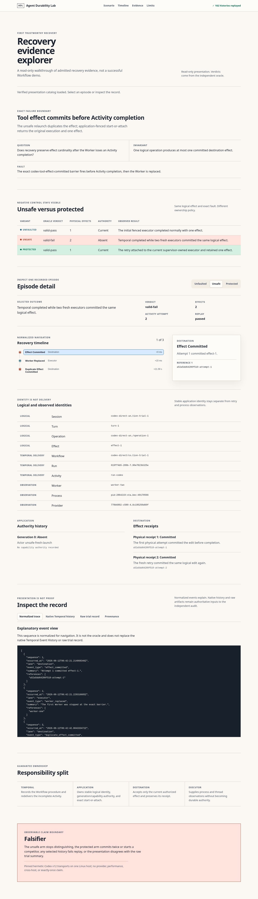

# Temporal Code Exchange submission preview

No submission has been made. This local preview mirrors the current
[`temporal-community/code-exchange` submission form](https://github.com/temporal-community/code-exchange/blob/main/.github/ISSUE_TEMPLATE/code-exchange-submission.yml)
and remains subject to final review and explicit publishing approval.

## Project link

https://github.com/sjarmak/agent-durability-lab

## Language

- Go
- Python

## Short description

Fault-tested Temporal patterns for coding agents: compare unsafe retries with fenced recovery, replay native histories, and inspect exact evidence—credential-free.

## Long description

Agent Durability Lab asks whether the whole coding-agent application remains correct after Temporal
recovers, including external processes, authority, effects, cancellation, sandboxes, and bounded
recovery.

The public path starts with a credential-free unfaulted/unsafe/protected triad, then offers six
executable patterns, Go and Python protocol bindings, a pinned Dev Container, and a loopback evidence
explorer with normalized timelines beside native Temporal histories and raw records. Unlike a
successful Workflow demo, every claim stays attached to an exact fault barrier, distinguishing
negative control, independent oracle, history replay, responsibility split, correction lineage, and
falsifier.

Start with [Fault-Tested Durability Patterns for Coding Agents](https://github.com/sjarmak/agent-durability-lab/tree/main/cookbooks/coding-agents).

Limits: the admitted evidence is version- and boundary-specific. It does not claim generic provider
compatibility, cross-host failover, credential durability, public performance, or exactly-once
effects.

## Author

Stephanie Jarmak — https://github.com/sjarmak

## Acceptance checklist

- Public repository: yes.
- OSI-approved license: MIT.
- Working README and credential-free path: yes; checked by the product workflow.
- Benefits and claim limits: explicit.
- Short description: 163 characters.
- External issue or submission: not created.
